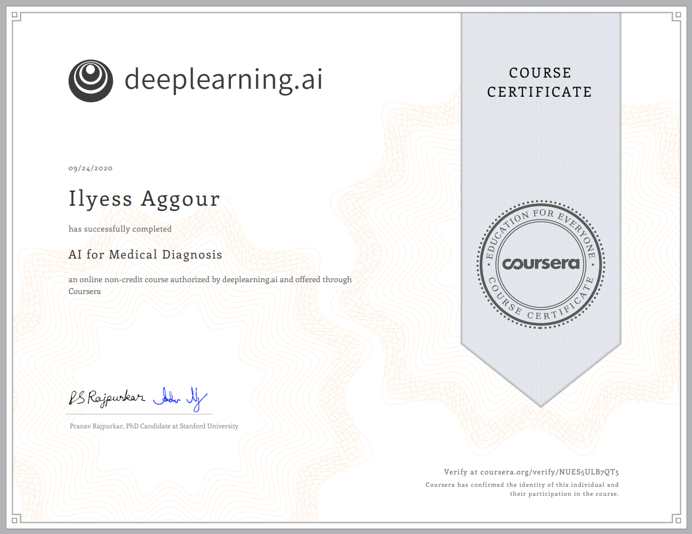

# AI For Medical Diagnosis

> First course of the specialization. How can AI be applied to medical imaging to diagnose diseases?

*Link to the [course](https://www.coursera.org/learn/ai-for-medical-diagnosis).*

## About this Course

In this first course, you’ll learn about the nuances of working with both **2D** and **3D** medical image data, for **multi-class classification** and **image segmentation**. You’ll then apply what you’ve learned to classify diseases in x-ray images and segment tumors in 3D MRI brain images. Finally, you’ll learn how to properly evaluate the performance of your models.

- Week 1 — **Disease detection with computer vision.**
  * Data pre-processing: checking for data leakage
  * Preprocess images properly for the train, validation and test sets
  * Implement a weighted loss function to address class imbalance.
  * Set up a pre-trained neural network to make disease predictions on chest x-rays.
- Week 2 — **Evaluating models.** 
  * Calculate true positives, true negatives, false positives, false negatives.
  * Calculate sensitivity and specificity
  * Calculate Positive Predictive Value (PPV) and Negative Predictive Value (NPV).
  * Understand confidence intervals, ROC curve, and F1 score.
- Week 3 — **Image segmentation on MRI images.**   
  * Perform image segmentation on 3D MRI data.
  * Take random sub-samples from a 3D image.
  * Standardize an input image.
  * Apply a pre-trained U-Net model.
  * Implement a proper loss function for model training (soft dice loss).
  * Evaluate model performance by calculating sensitivity and specificity.

## Certificate

