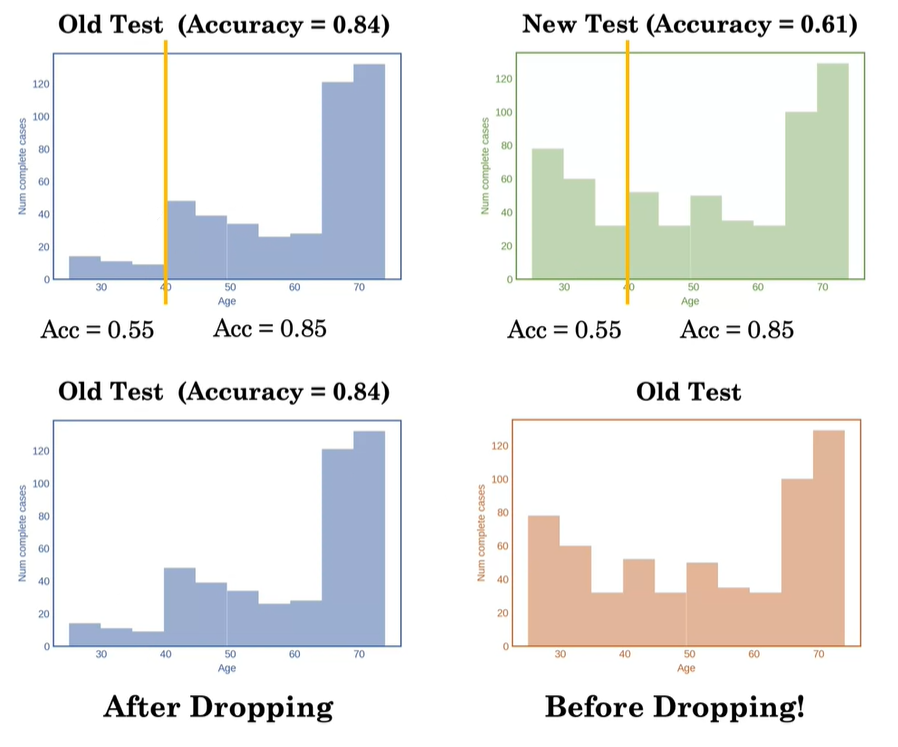
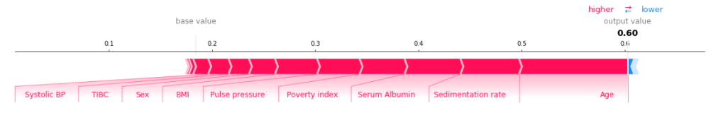

# Notes

> Notes of different teachings.

**Table of Contents**

- [Linear Prognostic Models](#linear-prognostic-models)
  
    + [Concordance Index (or C-Index)](#concordance-index--or-c-index-)
- [Prognosis with Tree-based models](#prognosis-with-tree-based-models)
    + [Missing Data](#missing-data)
    + [Random Forest interpretability : SHAP](#random-forest-interpretability---shap)
- [Survival Models & Time](#survival-models---time)
  
    + [Censoring](#censoring)
    + [Kaplan-Meier estimator](#kaplan-meier-estimator)
- [Risk Model](#risk-model)
    + [Cox Proportional Hazards](#cox-proportional-hazards)
    + [Relationship between Hazard and Survival](#relationship-between-hazard-and-survival)
    + [Cumulative Hazard](#cumulative-hazard)
  * [Survival Trees](#survival-trees)
    + [Nelson Aalen estimator](#nelson-aalen-estimator)

## Linear Prognostic Models

Medical Prognosis — `predicting the risk of a future event.`

#### Concordance Index (or C-Index)

The C-index represents the `model’s ability to correctly provide a reliable ranking of the survival times based on the individual risk scores.` 

If we gave to a model two random patients with different outcomes, the C-index will represent the **probability that the patient with the worst outcome gets the higher score.**

## Prognosis with Tree-based models

#### Missing Data

Dropping rows when dealing with missing data can be dangerous as it might **change the distribution** of some of our features and thus make our model biased.

In our example the model performs worse on the new test set but we can see the model performs equally as **bad on people that are younger than 40** years old on both the old and the new test set. The difference is that this population is very low on the old test set and much more important in the new test set. We can see then that `this difference in distribution was caused by dropping the rows with missing values.`

  

One reason this might have happened is because physicians may not regularly record blood pressure for young patients, but might be a routine part of care for older patients. 

There are a lot of `patterns like this which can generate a systematic missingness to the data`, such that when people are young or when people are really old, missing data might be more frequent, and we need to watch out for those in order to build models that are not biased.

------

3 missing data categories :

* **Missingness completely at random** — `doesn't induce any bias`. But most missingness is not completely at random.
* **Missingness at random** — `may induce bias` if linked to other features (for example flipping a coin for people < 40 years old).
* **Missingness not at random** — `induce bias`.

We cannot generally be sure whether the data are really missing at `random`, or whether the data missingness `depends on unobserved predictors`. However, it's important to be aware of the different possible missing data categories to understand how if we drop missing records we can **lead to a bias model.**

#### Random Forest interpretability : SHAP

*`SHAP` (SHapley Additive exPlanations)* is a cutting edge method that explains predictions made by black-box machine learning models.

> Given a prediction made by a machine learning model, SHAP values explain the prediction by quantifying the additive importance of each feature to the prediction. SHAP values have their roots in cooperative game theory, where Shapley values are used to quantify the contribution of each player to the game.

*Approach at the end of [week 2 assignment](Week%202%20-%20Prognosis%20with%20Tree-based%20models/W2_Assignment_Risk_Models_Using_TreeBased_Models.ipynb).*

## Survival Models & Time

**Survival** — `what is the probability of survival past any time t ?`

#### Censoring 

In the case of survival data, `the time to event may not be observed for a patient.` That is what we call censored data.

**Right Censoring** — `the time to event is only known to exceed a certain value.`

* #### Kaplan-Meier estimator 

  %20=%20\prod_{t_i%20\leq%20t}%20(1%20-%20\frac{d_i}{n_i}))

  *  are the events observed in the dataset
  *  is the number deaths at time 
  *  is the number of people who we know have survived up to time 

## Risk Model

#### Cox Proportional Hazards

**Hazard** — `what is a patient's immediate risk of death if they make it to time t ?`

%20=%20\lambda_0(t)e^{\theta^T%20X_i})

  * ) is the baseline hazard at time t
  *   is the coefficients of the features
  *  are the features of the patient

#### Relationship between Hazard and Survival

We can find the Survival using the Hazard (and vice versa) :

%20=%20exp(-\int_{0}^{t}\lambda(u)du)

#### Cumulative Hazard 

The cumulative hazard answers `what is a patient's accumulated hazard up to time t ?`

%20=%20\int_{0}^{t}\lambda(u)du)

**Limits of the Cox proportional hazard model** :

* Can't capture non-linear relationship of a feature.
* Hazard function for two patients is always proportional which means the shape of the risks for similar patients looks the same. 

### Survival Trees

The idea behind survival trees is to split the population into **multiple groups** and compute the hazard (or survival time, or cumulative hazard) for each of these groups.

* #### Nelson Aalen estimator 

  Estimator to compute the cumulative hazard estimate :

  %20=%20\sum_{i=0}^{t}\frac{d_{i}}{n_{i}})
  *  is the number of patients that died at time `i`
  *  is the number of patients that survived to time `i`
