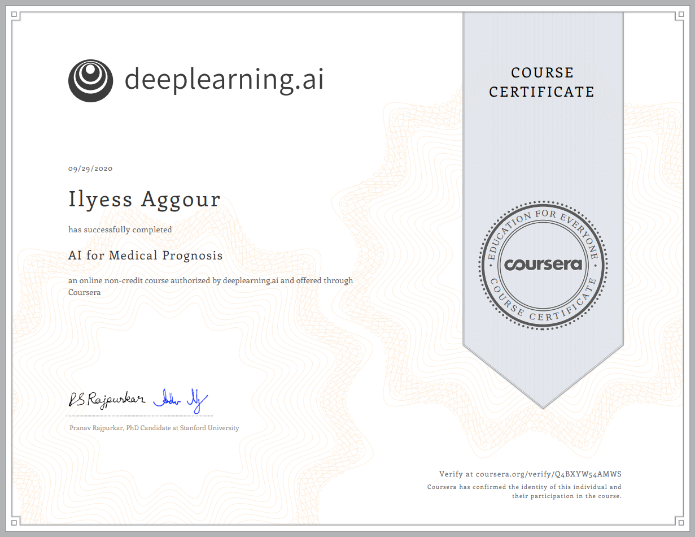

# AI For Medical Prognosis

> Second course of the specialization. AI approaches to prognostic tasks.

*Link to the [course](https://www.coursera.org/learn/ai-for-medical-prognosis).*

## About this Course

Machine learning is a powerful tool for prognosis, a branch of medicine that specializes in **predicting the future health of patients.** First, you’ll walk through multiple examples of prognostic tasks. You’ll then use **decision trees** to model non-linear relationships, which are commonly observed in medical data, and apply them to predicting mortality rates more accurately. Finally, you’ll learn how to handle missing data, a key real-world challenge.

- Week 1 — **Linear prognostic models.**
  * Build a linear prognostic model.
  * Evaluate the prognostic model by calculating the concordance index.
  * Improve the prognostic model by adding feature interactions.
  
- Week 2 — **Prognosis with Tree-based models.** 
  * Identify missing data.
  * Tune a decision tree’s hyperparameters based on its c-index.
  * Tune a random forest’s hyperparameters based on its c-index.
  * Use visual inspection to identify differences in distribution due to missing data.
  * Use mean imputation and regression imputation to fill in missing data.
  * Use Shapley Additive Explanations (SHAP) to quantify the importance of each feature to a random forest model’s predictions.
  
- Week 3 — **Survival Models and Time.**   
  * Understand and identify time to event data and censored data.
  * Calculate a naive estimate of survival.
  * Calculate the Kaplan Meier estimate of survival and compare it to the naive estimate.
  
- Week 4 — **Build a risk model using linear and tree-based models.**   

  * Fit and interpret a Cox Model, a linear estimate of the risk of disease.

  * Fit a random survival forest model (a non-linear risk model).

  * Calculate the relative risk between any two pairs of patients.

  * Calculate the Harell’s concordance index to evaluate both models.

    

## Certificate

