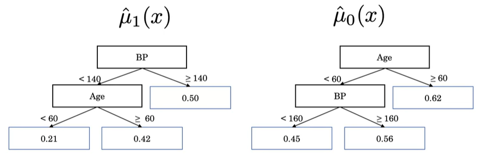
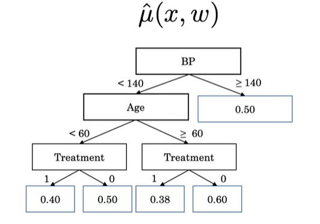

# Notes

> Notes of different teachings.

**Table of Contents**

- [Treatment Effect Estimation](#treatment-effect-estimation)
  * [Estimate the treatment effect for a patient](#estimate-the-treatment-effect-for-a-patient)
    + [Two-Tree Method (T-learner)](#two-tree-method--t-learner-)
    + [Single-Tree Method (S-learner)](#single-tree-method--s-learner-)
  * [Evaluation Metric : C-statistic-for-benefit (C-for-benefit)](#evaluation-metric---c-statistic-for-benefit--c-for-benefit-)
- [ML Interpretation](#ml-interpretation)
    + [CNN Interpretation](#cnn-interpretation)

## Treatment Effect Estimation

**Absolut Risk Reduction (ARR)** —  `average reduction in risk with treatment.`

**Randomized controlled trial (RCT)** — ` medical experiment where we randomly allocate subjects to two or more groups, treat them differently and then compare them with respect to a measured response.`

**Neyman-Rubin causal model**

We could estimate the **effect of a treatment on a patient** if we knew for each patient the `outcome with` and `without the treatment.`

We would average the outcomes with treatment ) that we would substract with the averages of the outcomes without treatment ). The result we would obtain is called the **Average Treatment Effect (ATE)** —  `expectation of the difference in the potential outcomes.`

However in reality this is impossible because for each patient, we **only observe one outcome** (treatment or no treatment). 
- We can't give a patient treatment, then go back in time and measure an alternative scenario where the same patient did not receive the treatment.

We can still compute the ATE by **grouping the patients** who got the treatment in one group, and the ones who didn't in another group. For each group, we can then compute the average of the outcomes and we would use these to compute the ATE.

**Relationship between ATE and ARR**

### Estimate the treatment effect for a patient

* #### Two-Tree Method (T-learner)

  We model the relationship between features and the outcome with `two decision trees` :

  * One is trained with data from the **patients who got the treatment.**
  * The other one is trained with data from the **patients who didn't get the treatment.**

  **Disadvantage** : two trees &rarr;  less data available for each tree &rarr; `might miss out on relationships between features.`

* #### Single-Tree Method (S-learner)

  We model the relationship between features and the outcome with `one decision tree`.

  **Disadvantage** : might learn a tree that may decide `not to use the treatment feature at all`, even if the tree achieves a great estimate of the outcome.

### Evaluation Metric : C-statistic-for-benefit (C-for-benefit)

Since for each patient we only observe either their treatment outcome or their baseline outcome, we can not determine each patient's actual risk reduction.

As such we estimate the treated/untreated patient using a pair of `patients matched across treatment and control arms based on predicted ARR`:

- Now, in each pair, we observe **both outcomes**, so we'll have an estimate of the true treatment effect.
- In the pair of patients (A,B),
  - Patient A receives the treatment
  - Patient B does not receive the treatment.

The **risk reduction** for each pair is:

- **1** if the treated person A survives and the untreated B person does not (`treatment benefits`).
- **-1** if the treated person A dies and the untreated person B doesn't (`treatment harms`).
- **0** otherwise (`treatment has no effect`, because both patients in the pair live, or both die).

The **C-for-benefit** is computed like the **C-Index** but instead of comparing patients we compare `pairs of patients`.

* Permissible pairs are pairs where the `observed benefit is different.`
* Concordant pairs are pairs where the `predicted estimate is higher for the pair with the higher observed outcome.`
* Risk ties are pairs with the same `predicted estimate.`

## ML Interpretation

2 methods presented to find out **how much a feature contributes to a model** :

* Drop feature : comparing the model performance `with and without a certain feature.`
* Permutation method : build a model with `permutated values of the data for a certain feature` and compare the performances with the regular model.

We can also use the same idea behind the `drop feature method` to evaluate **how much a feature contributes to a single particular prediction.**

Here is an example for the importance of the Age feature on a model trained with 2 features :

%20=%20f(\{BP,%20Age\})%20-%20f(\{BP\}))

However, this method **can fail** to recognize important features when there are `correlated features.`

To overcome that challenge we can compute the **[Shapley Values](https://github.com/slundberg/shap)**.

#### CNN Interpretation

To interpret CNN models we can build a `heatmap of the areas that were of the most importance` for a particular prediction.

