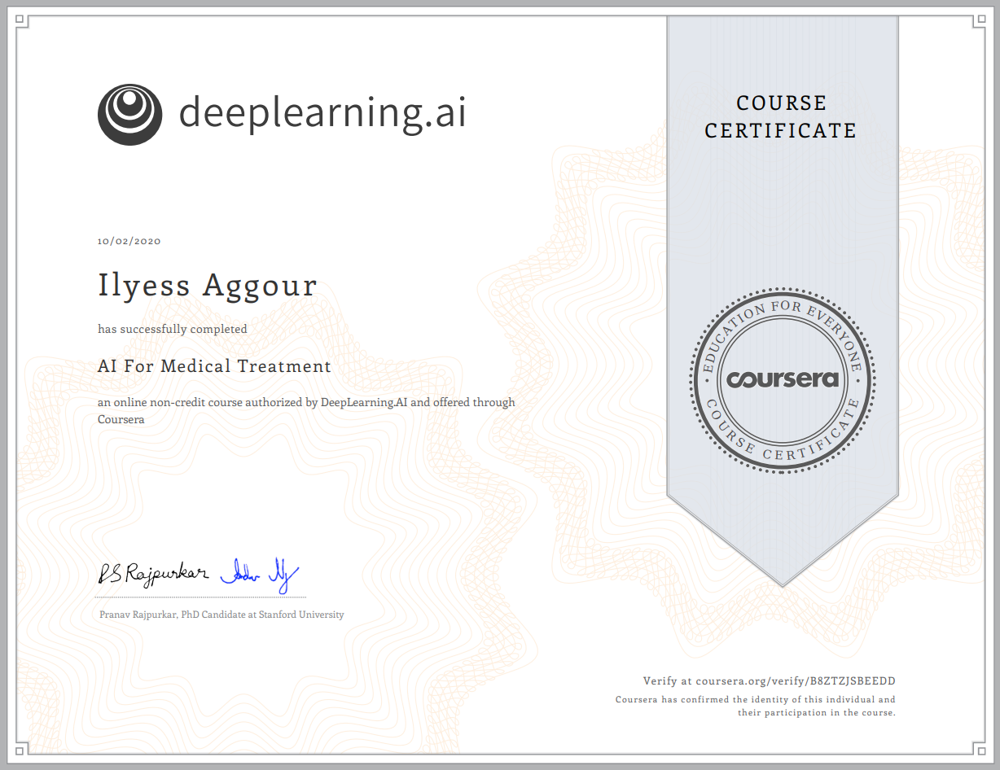

# AI For Medical Treatment

> Third course of the specialization. Using AI to estimate treatment effects and extract information from medical reports.

*Link to the [course](https://www.coursera.org/learn/ai-for-medical-treatment).*

## About this Course

Medical treatment may impact patients differently based on their existing health conditions. In this final course, you’ll estimate **treatment effects** using data from randomized control trials and applying tree-based models. In the second week, you’ll use natural language entity extraction and **question-answering methods** to automate the task of **labeling** medical datasets. In the final week of this course, you’ll apply machine learning **interpretation methods** to explain the decision-making of complex machine learning models.

- Week 1 — **Treatment Effect Estimation.**
  * Analyze data from a randomized control trial
  * Interpreting Multivariate Models
  * Evaluating Treatment Effect Models
  * Interpreting ML models for Treatment Effect Estimation
  
- Week 2 — **Medical Question Answering.** 
  * Extracting disease labels from clinical reports
  * Question Answering with BERT
  
- Week 3 — **ML Interpretation.**   

  * Feature Importance in Machine Learning

  * Interpreting Deep Learning Models

    

## Certificate

