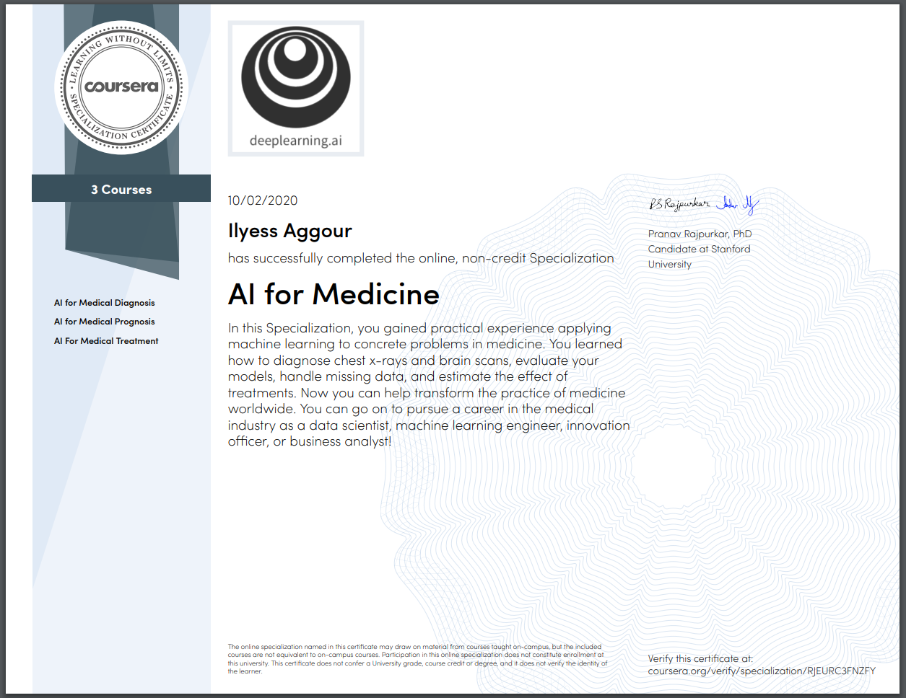

# AI For Medicine Specialization

> Applying machine learning to concrete problems in medicine. [Specialization](https://www.coursera.org/specializations/ai-for-medicine) offered by [deeplearning.ai](https://www.deeplearning.ai/).

## About this Specialization

AI is transforming the practice of medicine. It’s helping doctors **diagnose patients** more accurately, make **predictions about patients’ future health**, and recommend better **treatments**. In this Specialization, you’ll gain practical experience applying machine learning to concrete problems in medicine. You’ll learn how to:

- Diagnose diseases from x-rays and 3D MRI brain images
- Predict patient survival rates more accurately using tree-based models
- Estimate treatment effects on patients using data from randomized trials
- Automate the task of labeling medical datasets using natural language processing

------

* ### Course 1 : AI For Medical Diagnosis

  * Week 1 — **Disease detection with computer vision.**
  * Week 2 — **Evaluating models.** 
  * Week 3 — **Image segmentation on MRI images.**   

------

* ### Course 2 : AI For Medical Prognosis

  * Week 1 — **Linear prognostic models.**
  * Week 2 — **Prognosis with Tree-based models.** 
  * Week 3 — **Survival Models and Time.**   
  * Week 4 — **Build a risk model using linear (Cox) and tree-based models.**   

------

* ### Course 3 : AI For Medical Treatment

  * Week 1 — **Treatment Effect Estimation.**

  * Week 2 — **Medical Question Answering.** 

  * Week 3 — **ML Interpretation.**   

  

## Certificate

