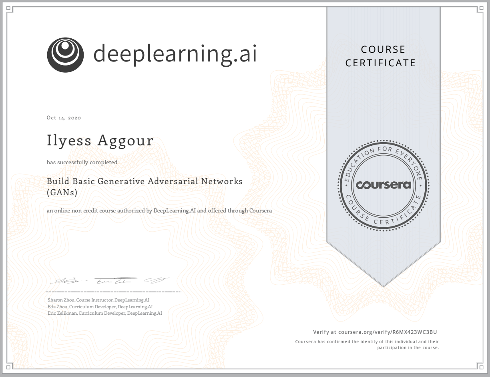

# Build Basic Generative Adversarial Networks (GANs)

> First course of the specialization. Understand, explore and implement multiple GAN architectures.

*Link to the [course](https://www.coursera.org/learn/build-basic-generative-adversarial-networks-gans).*

## About this Course

In this course, you will learn about GANs and their applications, understand the intuition behind the **fundamental components of GANs**, explore and implement multiple GAN architectures (**DCGAN**, **WGAN**, **SNGAN** ...) and build **conditional** GANs capable of generating examples from **determined categories**.

* Week 1 — **Intro to GANs.**
  * Construct your first GAN.
  * Develop intuition behind GANs and their components.
  * Examine real life applications of GANs.

- Week 2 — **Deep Convolutional GANs.** 
  * Be able to explain the components of a Deep Convolutional GAN.
  * Compose a Deep Convolutional GAN using these components.
  * Examine the difference between upsampling and transposed convolutions.
- Week 3 — **Wasserstein GANs with Gradient Penalty.**   
  * Examine the cause and effect of an issue in GAN training known as **mode collapse**.
  * Implement a Wasserstein GAN with Gradient Penalty to remedy mode collapse.
  * Understand the motivation and condition needed for Wasserstein-Loss.
- Week 4 — **Conditional GAN & Controllable Generation.** 
  * Control GAN generated outputs by adding conditional inputs.
  * Control GAN generated outputs by manipulating z-vectors.
  * Be able to explain **disentanglement** in a GAN.

## Certificate

