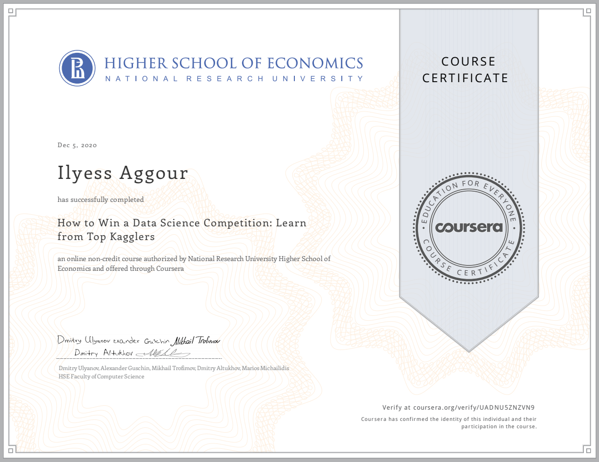

# How To Win A Data Science Competition

> Learn to analyze and solve competitively predictive modelling tasks.

*Link to the [course](https://www.coursera.org/learn/competitive-data-science).*

## About this Course

Goals of this course : 

- Understand how to solve predictive modelling competitions efficiently and learn which of the skills obtained can be applicable to real-world tasks. 
- Learn how to **preprocess** the data and **generate new feature**s from various sources such as text and images. 
- Be taught **advanced feature engineering** techniques like generating **mean-encodings**, using aggregated statistical measures or finding nearest neighbors as a means to improve your predictions. 
- Be able to form reliable **cross validation** methodologies that help you benchmark your solutions and avoid `overfitting` or `underfitting` when tested with unobserved (test) data.
- Gain experience of analyzing and interpreting the data. You will become aware of inconsistencies, high noise levels, errors and other data-related issues such as `leakages` and you will learn how to overcome them.
- Acquire knowledge of different algorithms and learn how to efficiently **tune their hyperparameters** and achieve top performance.
- Master the art of combining different machine learning models and learn how to ensemble.
- Get exposed to past (winning) solutions and codes and learn how to read them.

------

* Week 1.1 — **Introduction & Recap.**
  * Describe competition mechanics
  * Compare real life applications and competitions
  * Describe main types of ML algorithms
  * Analyze decision boundaries of different classifiers
  * Use standard ML libraries

* Week 1.2 — **Feature Preprocessing & Generation.**   
  * Explain how employed model impacts choice of preprocessing
  * Summarize feature preprocessing for `numeric and categorical features`
  * Summarize feature generation approaches for `datetime and coordinates`
  * Summarize approaches to deal with `missing values`
  * Outline the pipeline of applying Bag of Words
  * Compare Bag of Words and Word2vec
  * Explain how to extract CNN descriptors from images

- Week 2.1 — **Exploratory Data Analysis.** 
  * Describe the major visualization tools
  * Generate hypotheses about data
  * Inspect the data and find golden features
  * Examine and analyze various plots and other data visualizations
- Week 2.2 — **Validation.** 
  * Describe validation process and its purpose
  * Compare `validation strategies`
  * Identify train/test split in a competition
  * Identify and analyze validation problems
- Week 2.3 — **Data Leakage.** 
  * Embrace the concept of data leakage
  * Find and exploit typical data leakages
  * Probe public leaderboard
- Week 3.1 — **Metrics Optimization.**   
  * Describe the role of correct metric optimization method in a competition
  * Analyze new metrics
  * Create constant baselines
  * Recall the most important classification and regression metrics
  * Describe what libraries can be used to optimize a particular metric
- Week 3.2 — **Mean Encoding.**   
  * Regularize mean encodings
  * Extend mean encodings
  * Summarize the concept of mean encodings
- Week 4.1 — **Hyperparameter Optimization.**   
  * List most important hyperparameters in major models; describe their impact
  * Understand the hyperparameter tuning process in general
  * Arrange hyperparameters by their importance
- Week 4.2 — **Advanced feature engineering.** 
  * Understand matrix factorization technique for feature extraction
  * Create features based on tSNE
  * Explain concept of feature interactions
  * Generate and make up new features based on statistics and nearest neighbors
- Week 4.3 — **Ensembling.** 
  * Describe and compare ensembling methods
  * List and describe plan of validation schemes for ensembling
  * Compare validation schemes
  * Successfully implement ensembling in practical task

## Certificate

