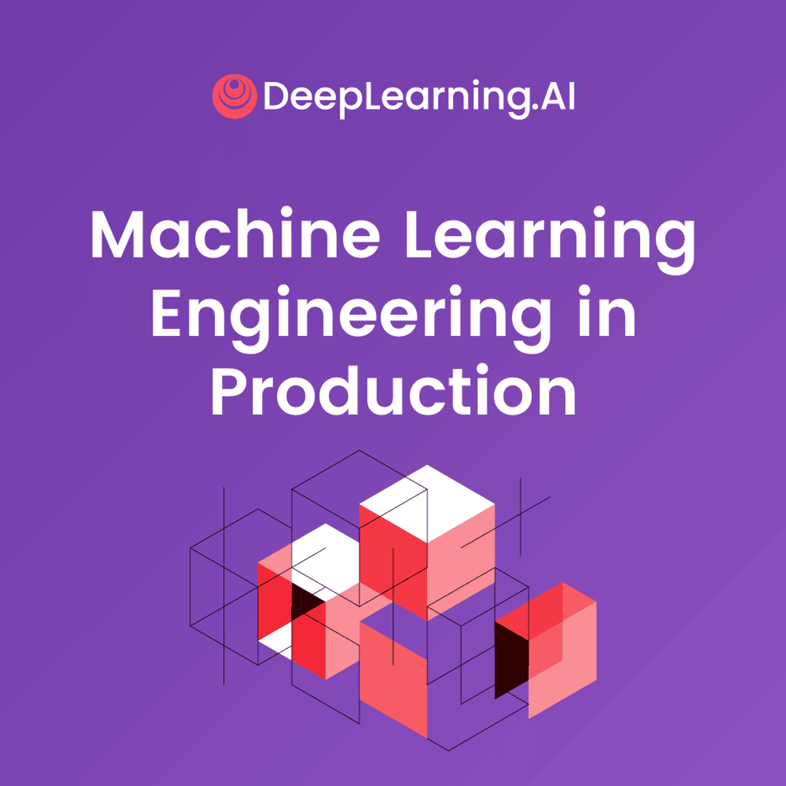

# Machine Learning in Production

> Build intuition about designing a production ML system end-to-end: project scoping, data needs, modeling strategies, and deployment patterns and technologies.

  

*Link to the [course](https://www.coursera.org/learn/introduction-to-machine-learning-in-production).*

## About this course

Machine learning engineering for production refers to the tools, techniques, and practical experiences that transform theoretical ML knowledge into a production-ready skillset.	

In this Machine Learning in Production course, you will build intuition about designing a production ML system end-to-end: project scoping, data needs, modeling strategies, and deployment patterns and technologies. You will learn strategies for addressing common challenges in production like establishing a model baseline, addressing concept drift, and performing error analysis. You’ll follow a framework for developing, deploying, and continuously improving a productionized ML application.

Understanding machine learning and deep learning concepts is essential, but if you’re looking to build an effective AI career, you need experience preparing your projects for deployment as well. Machine learning engineering for production combines the foundational concepts of machine learning with the skills and best practices of modern software development necessary to successfully deploy and maintain ML systems in real-world environments.

By the end of this program, you will be ready to:

- Design an ML production system end-to-end: project scoping, data needs, modeling strategies, and deployment requirements.
- Establish a model baseline, address concept drift, and prototype how to develop, deploy, and continuously improve a productionized ML application.

__Week 1 : Overview of the ML Lifecycle and Deployment__

- Identify the key components of the ML project lifecycle and pipeline and select the best deployment and monitoring patterns for different production scenarios

__Week 2 : Modeling Challenges and Strategies__

- Optimize model performance and metrics by prioritizing  disproportionately important examples that represent key slices of a dataset.

__Week 3 : Data Definition and Baseline__

- Solve production challenges specific to structured, unstructured, small, and big data. Understand why label consistency is essential and how you can improve it.