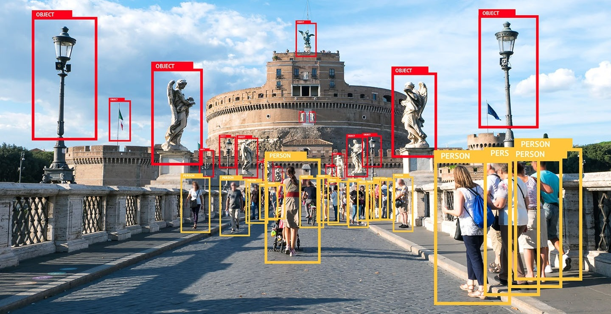

# MIT 6.S191 Lab 2: Computer Vision

  

## Part 1: MNIST Digit Classification
In the first portion of this lab, we will build and train a convolutional neural network (CNN) for classification of handwritten digits from the famous [MNIST](http://yann.lecun.com/exdb/mnist/) dataset. The MNIST dataset consists of 60,000 training images and 10,000 test images. Our classes are the digits 0-9.

## Part 2: Debiasing Facial Detection Systems
In the second portion of the lab, we'll explore two prominent aspects of applied deep learning: facial detection and algorithmic bias. Deploying fair, unbiased AI systems is critical to their long-term acceptance. Consider the task of facial detection: given an image, is it an image of a face? This seemingly simple, but extremely important, task is subject to significant amounts of algorithmic bias among select demographics.

In this lab, we'll investigate [one recently published approach](http://introtodeeplearning.com/AAAI_MitigatingAlgorithmicBias.pdf) to addressing algorithmic bias. We'll build a facial detection model that learns the *latent variables* underlying face image datasets and uses this to adaptively re-sample the training data, thus mitigating any biases that may be present in order to train a *debiased* model.

*[Here](https://github.com/aamini/introtodeeplearning_labs) is the official repository.*